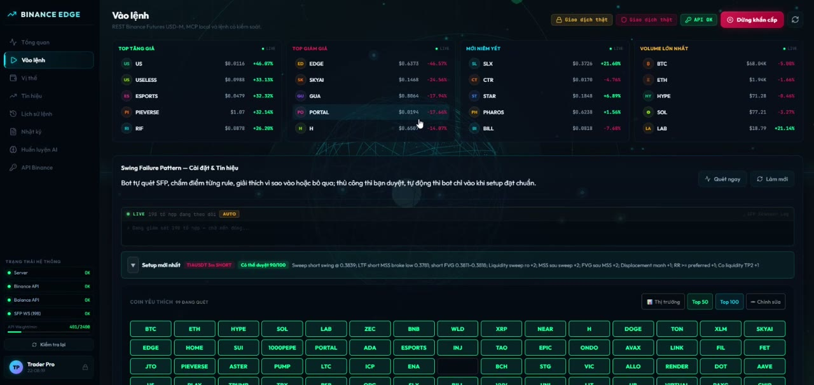
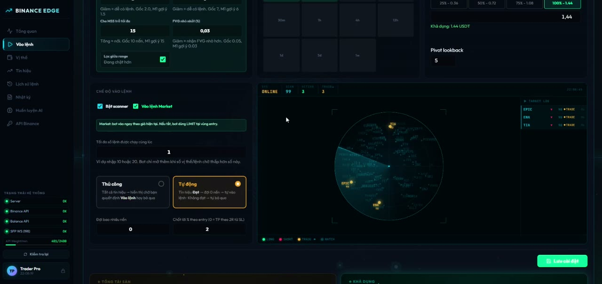
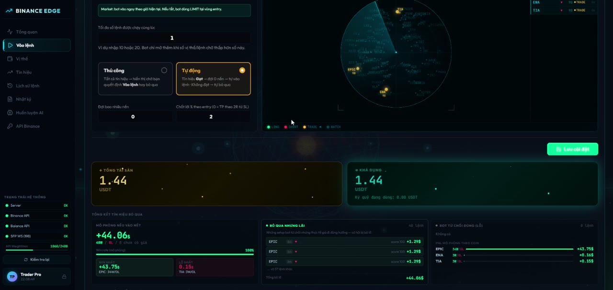
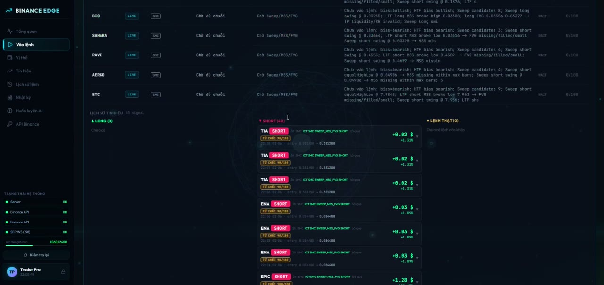

<p align="center">
  
</p>

# Binance MCP Auto Trader

Binance MCP Auto Trader is a local-first crypto futures trading workstation for Binance USD-M Futures. It gives traders a single place to scan markets, review rule-based setups, inspect risk, run dry-run execution, and optionally automate protected entries with stop loss and take profit controls.

The project is built for traders who want more than a simple alert script: it combines a React dashboard, a TypeScript backend, SQLite trade state, Binance REST/WebSocket integrations, and an MCP server so AI clients can safely inspect market context and request guarded trading actions.

> This is educational software, not financial advice. Crypto futures are high risk. Start with testnet and dry-run mode, and never use API keys with withdrawal permissions.

## Demo

[Open the live video viewer](https://quocbaolabs.github.io/binance-mcp-auto-trader/demo.html)

Fallback: [raw MP4 file](https://raw.githubusercontent.com/QuocBaoLabs/binance-mcp-auto-trader/main/assets/demo.mp4)

## Screenshots

| Market Scanner | Strategy Settings |
| --- | --- |
|  |  |

| Radar View | Signal Table |
| --- | --- |
|  |  |

## Why Use This Bot?

Manual futures trading becomes difficult when you are watching dozens of symbols, checking structure, calculating stop distance, comparing reward-to-risk, and trying to avoid duplicate or emotional entries. This bot is designed to reduce that operational load.

- It scans many symbols continuously instead of forcing you to watch charts one by one.
- It converts strategy rules into visible, explainable signals with score, direction, entry, stop loss, take profit, and rejection reasons.
- It keeps execution guarded: every protected trade must pass risk checks before reaching Binance.
- It supports manual review, semi-automatic confirmation, and automated execution modes.
- It records signals, orders, logs, and risk state locally so you can audit what happened later.
- It exposes MCP tools so an AI assistant can help inspect market context without receiving raw exchange secrets.

The goal is not to guarantee profitable trades. The goal is to make signal discovery, risk review, and execution discipline more systematic.

## Core Benefits

### 1. Faster Market Scanning

The dashboard can monitor a large watchlist across selected timeframes, rank signals, and show which assets are active, waiting, rejected, or ready for review.

### 2. Explainable Strategy Decisions

Signals include readable summaries and rule-level detail: why a setup passed, why it failed, where the stop belongs, whether reward-to-risk is acceptable, and whether the entry is chasing too far from the setup candle.

### 3. Safer Execution Workflow

The bot starts locked down. Read-only mode, dry-run mode, Binance testnet mode, max order size, max open positions, leverage caps, daily loss limits, and required TP/SL checks are enabled before live trading is possible.

### 4. Local-First Privacy

Secrets stay in `.env` on your machine. Runtime data is stored locally in SQLite. The dashboard only sees masked credential status, not raw API keys or request signatures.

### 5. AI-Friendly Through MCP

The MCP server gives compatible AI clients structured tools for market data, balances, positions, open orders, and guarded trade requests. Order tools still go through the same risk manager as the dashboard.

## Strategy Engines

The bot includes multiple strategy families. You can run one or combine scanners depending on your trading style.

### Swing Failure Pattern (SFP)

The SFP engine looks for liquidity sweeps around recent swing highs/lows, then checks whether price rejects back into the range.

It evaluates:

- swing sweep direction and confirmation
- wick rejection quality
- sweep depth relative to ATR
- entry distance from the setup candle
- volume ratio versus recent candles
- stop placement around the sweep wick
- reward-to-risk quality
- maximum stop distance by timeframe
- liquidation buffer and stop safety
- optional candlestick confluence

The engine turns those checks into a score. Weak setups remain visible for learning/review, while setups with fatal risk issues are blocked from auto execution.

### Candlestick Confluence

The candlestick scanner can detect reversal and continuation patterns, then compare them with SFP direction. When candlestick direction agrees with SFP, the setup receives stronger confirmation. When it conflicts, the threshold becomes stricter.

This is useful for filtering raw SFP events so the bot does not treat every liquidity sweep as a trade candidate.

### Wyckoff Accumulation / Distribution

The Wyckoff module looks for market phases around accumulation and distribution behavior. It uses pivots, RSI context, trend sensitivity, volume filters, breakout buffers, and retest tolerance to identify potential long/short setups.

It is designed for traders who want to detect structure-based reversals and breakouts rather than purely indicator-based entries.

### ICT / SMC Engine

The ICT/SMC module scans multi-timeframe structure and liquidity behavior. It focuses on the sequence many discretionary SMC traders look for:

- higher-timeframe and lower-timeframe swing structure
- liquidity pools
- liquidity sweep
- market structure shift
- displacement
- fair value gap
- OTE-style retracement zone
- nearest liquidity or swing target
- preferred reward-to-risk
- middle-of-range avoidance

The engine scores candidate trades and can reject them when the setup lacks confluence, the stop is too wide, reward-to-risk is poor, or the trade appears in an undesirable range location.

### Rule / Indicator Engine

The rule engine supports classic signal ingredients such as EMA, RSI, SuperTrend, Bollinger Bands, Parabolic SAR, volume change, funding rate, open interest, and long/short ratio.

It can be used as a simpler baseline strategy or as extra context beside SFP, Wyckoff, and SMC signals.

## Signal Lifecycle

1. The backend pulls or streams market data from Binance.
2. Enabled strategy engines scan the selected symbols and timeframes.
3. Each candidate setup is scored and explained.
4. The bot calculates entry, stop loss, take profit, leverage, margin mode, and risk shape.
5. Risk manager checks decide whether the setup can be executed.
6. Signals are stored in SQLite and shown in the dashboard.
7. In manual mode, the trader reviews and confirms.
8. In auto mode, eligible signals can place protected orders.
9. The monitor tracks pending, executed, TP-hit, SL-hit, ignored, and rejected signals.

## Execution Modes

- `READ_ONLY=true`: inspect data only; no trading actions.
- `DRY_RUN=true`: simulate execution without placing Binance orders.
- `BINANCE_TESTNET=true`: use Binance Futures testnet endpoints.
- `AUTO_TRADE_ENABLED=false`: require manual review.
- `SFP_AUTO_EXECUTE=false`: keep SFP scanner from auto-filling slots.
- `ENABLE_LIVE_TRADING=false`: hard backend-level live trading lock.

This layered setup is intentional. Live trading should require multiple explicit changes, not one accidental toggle.

## Risk Controls

The risk manager can block trades when:

- read-only mode is enabled
- auto trading is disabled
- the symbol is not allowed
- API credentials are missing for non-dry-run execution
- stop loss or take profit is missing
- order notional exceeds `MAX_ORDER_USDT`
- daily realized loss reaches `MAX_DAILY_LOSS_USDT`
- open positions reach `MAX_OPEN_POSITIONS`
- requested leverage exceeds `MAX_LEVERAGE`
- market orders are disabled
- reward-to-risk is below the configured threshold
- stop distance is too small, too large, or unsafe for the timeframe
- there is already an active position or pending duplicate setup

The emergency stop path pauses strategy execution, turns off auto trading, and attempts to cancel open orders for allowed symbols.

## Dashboard Features

- health panel for server, Binance API, balance API, and WebSocket status
- symbol watchlist and top market movers
- live scanner status and signal radar
- signal table with pending, ignored, rejected, executed, TP, and SL states
- strategy settings for SFP, SMC, Wyckoff, indicators, leverage, and timeframes
- protected order controls
- position and available-balance panels
- audit log and order history
- emergency stop control
- optional Telegram signal delivery with chart attachments
- optional AI training workflow for local strategy notes

## MCP Tools

The MCP server runs over stdio and exposes structured tools:

- `get_price`
- `get_klines`
- `get_funding_rate`
- `get_open_interest`
- `get_long_short_ratio`
- `get_balance`
- `get_position`
- `get_open_orders`
- `create_limit_order`
- `create_stop_loss_order`
- `create_take_profit_order`
- `cancel_order`
- `close_position`

Trading tools are not shortcuts around safety. They are routed through the same protected execution and risk checks as the dashboard.

## Architecture

```text
.
|-- assets/                 # Logo, screenshots, and demo media
|-- dashboard/              # React + Vite dashboard
|-- docs/                   # Strategy notes
|-- server/
|   |-- src/binance/        # REST and WebSocket Binance clients
|   |-- src/strategy/       # Rule, SFP, Wyckoff, and ICT/SMC strategy code
|   |-- src/sfp/            # SFP scanner and signal monitor
|   |-- src/risk/           # Risk manager, liquidation guard, position logic
|   |-- src/orders/         # Protected order executor
|   |-- src/mcp/            # MCP stdio server
|   `-- src/db/             # SQLite persistence
|-- .env.example            # Safe environment template
|-- package.json
`-- README.md
```

## Tech Stack

- Node.js + TypeScript backend
- Express API with Server-Sent Events
- MCP server over stdio
- React 19 + Vite dashboard
- SQLite via `better-sqlite3`
- Binance USD-M Futures REST and WebSocket integrations
- Native Node test runner with `tsx`

## Installation

Requirements:

- Node.js 20 or newer
- npm
- Binance Futures testnet or live API credentials, if you want signed account endpoints or trading

Install dependencies:

```bash
npm install
```

Create a local environment file:

```bash
cp .env.example .env
```

On Windows PowerShell:

```powershell
Copy-Item .env.example .env
```

## Running Locally

Start the backend and dashboard together:

```bash
npm run dev
```

Default local URLs:

```text
Dashboard: http://127.0.0.1:5173
Backend:   http://127.0.0.1:3001
```

Run only the MCP server:

```bash
npm run dev:mcp
```

Build production output:

```bash
npm run build
```

Start the built backend:

```bash
npm run start
```

## MCP Client Configuration

```json
{
  "mcpServers": {
    "binance-auto-trader": {
      "command": "npm",
      "args": ["run", "dev:mcp"],
      "cwd": "/absolute/path/to/binance-mcp-auto-trader"
    }
  }
}
```

## Environment Variables

Core credentials:

```env
BINANCE_API_KEY=
BINANCE_API_SECRET=
AI_API_KEY=
TELEGRAM_BOT_TOKEN=
TELEGRAM_CHAT_ID=
```

Safe defaults:

```env
READ_ONLY=true
AUTO_TRADE_ENABLED=false
DRY_RUN=true
BINANCE_TESTNET=true
ENABLE_LIVE_TRADING=false
ALLOW_MARKET_ORDER=false
ALLOWED_SYMBOLS=BTCUSDT,ETHUSDT
MAX_ORDER_USDT=25
MAX_DAILY_LOSS_USDT=50
MAX_OPEN_POSITIONS=1
MAX_LEVERAGE=1
TP_PERCENT=1.5
SL_PERCENT=0.8
MIN_CONFIDENCE=70
```

See `.env.example` for the full template.

## Live Trading Checklist

Before enabling live trading:

1. Use Binance testnet until the full order lifecycle behaves as expected.
2. Keep `DRY_RUN=true` until simulated orders, logs, and position state are correct.
3. Use a dedicated Binance API key with the minimum required futures permissions.
4. Disable withdrawal permissions on the key.
5. Restrict the key by IP when possible.
6. Set conservative values for `MAX_ORDER_USDT`, `MAX_DAILY_LOSS_USDT`, `MAX_OPEN_POSITIONS`, and `MAX_LEVERAGE`.
7. Confirm every strategy path creates both stop loss and take profit protection.
8. Set `ENABLE_LIVE_TRADING=true` only after accepting the operational risk.

Live trading requires all of these to be intentionally changed:

```env
READ_ONLY=false
AUTO_TRADE_ENABLED=true
DRY_RUN=false
BINANCE_TESTNET=false
ENABLE_LIVE_TRADING=true
```

## Data, Logs, And Secrets

The following are intentionally excluded from git:

- `.env` and local env variants
- SQLite databases and WAL/SHM files
- generated signal charts
- server and dev logs
- build output
- `node_modules`
- local binaries and tunnel helpers
- personal assistant/workspace folders

If a secret was ever committed to a public repository, rotate that credential immediately. Removing a value from files is not enough after it has entered git history.

## Development

Run type checks:

```bash
npm run typecheck
```

Run tests:

```bash
npm test
```
Built with 🖤 by QuocBaoLabs

Stay in the shadows.
## Official Binance References

- USD-M Futures general information: https://developers.binance.com/docs/derivatives/usds-margined-futures/general-info
- Kline/candlestick data: https://developers.binance.com/docs/derivatives/usds-margined-futures/market-data/rest-api/Kline-Candlestick-Data
- Symbol price ticker: https://developers.binance.com/docs/derivatives/usds-margined-futures/market-data/rest-api/Symbol-Price-Ticker-v2
- Funding rate history: https://developers.binance.com/docs/derivatives/usds-margined-futures/market-data/rest-api/Get-Funding-Rate-History
- Open interest: https://developers.binance.com/docs/derivatives/usds-margined-futures/market-data/rest-api/Open-Interest
- Long/short ratio: https://developers.binance.com/docs/derivatives/usds-margined-futures/market-data/rest-api/Long-Short-Ratio
- New order: https://developers.binance.com/docs/derivatives/usds-margined-futures/trade/rest-api/New-Order
- Cancel order: https://developers.binance.com/docs/derivatives/usds-margined-futures/trade/rest-api/Cancel-Order
- Account balance V3: https://developers.binance.com/docs/derivatives/usds-margined-futures/account/rest-api/Futures-Account-Balance-V3
- Position information V3: https://developers.binance.com/docs/derivatives/usds-margined-futures/trade/rest-api/Position-Information-V3
