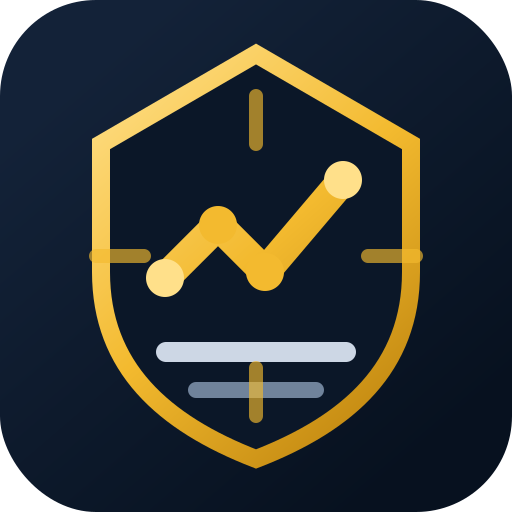

<p align="center">
  
</p>

# Binance MCP Auto Trader

Binance MCP Auto Trader is a local-first TypeScript trading workstation for Binance USD-M Futures. It combines a Node.js backend, a Model Context Protocol (MCP) server, a React dashboard, risk controls, SQLite persistence, and rule-based strategy engines for market scanning, signal review, dry-run execution, and tightly controlled live trading.

> This project is educational software, not financial advice. Trading crypto futures is high risk. Start with testnet and dry-run mode, and never use API keys with withdrawal permissions.

## What It Does

- Runs a local backend that talks to Binance USD-M Futures through the official REST and WebSocket APIs.
- Exposes MCP tools so compatible AI clients can read market data, inspect account state, and request guarded order actions.
- Provides a Vite + React dashboard for health checks, market signals, positions, settings, order history, audit logs, emergency stop, and AI training workflows.
- Stores runtime state in SQLite under `data/`, which is intentionally ignored by git.
- Generates strategy signals from rule, SFP, candlestick, Wyckoff, and ICT/SMC-style modules.
- Blocks risky execution by default through read-only mode, dry-run mode, testnet mode, TP/SL validation, position limits, leverage limits, and daily-loss controls.
- Can optionally send chart-backed signal notifications to Telegram when credentials are configured locally.

## Safety Defaults

The application starts locked down:

```env
READ_ONLY=true
AUTO_TRADE_ENABLED=false
DRY_RUN=true
BINANCE_TESTNET=true
ALLOW_MARKET_ORDER=false
ENABLE_LIVE_TRADING=false
```

The dashboard never receives raw Binance secrets from the backend. API keys are read from `.env` and masked in logs and status responses.

## Tech Stack

- Node.js + TypeScript backend
- Express API with Server-Sent Events
- MCP server over stdio
- React 19 + Vite dashboard
- SQLite via `better-sqlite3`
- Binance USD-M Futures REST and WebSocket integrations
- Native Node test runner with `tsx`

## Project Structure

```text
.
├── assets/                 # Repository artwork
├── dashboard/              # React dashboard
├── docs/                   # Strategy notes
├── server/                 # Backend, MCP server, risk, strategy, Binance clients
├── package.json            # Scripts and dependencies
├── .env.example            # Safe environment template
└── README.md
```

Ignored runtime folders include `node_modules/`, `dist/`, `data/`, `bin/`, logs, local assistant files, and `.env`.

## Installation

Requirements:

- Node.js 20 or newer
- npm
- Binance Futures testnet or live API credentials, if you want signed account endpoints or trading

Install dependencies:

```bash
npm install
```

Create a local environment file:

```bash
cp .env.example .env
```

On Windows PowerShell:

```powershell
Copy-Item .env.example .env
```

## Running Locally

Start the backend and dashboard together:

```bash
npm run dev
```

Default local URLs:

```text
Dashboard: http://127.0.0.1:5173
Backend:   http://127.0.0.1:3001
```

Run only the backend:

```bash
npm run dev:api
```

Run only the dashboard:

```bash
npm run dev:dashboard
```

Build production output:

```bash
npm run build
```

Start the built backend:

```bash
npm run start
```

## MCP Server

Run the MCP server over stdio:

```bash
npm run dev:mcp
```

Example MCP client configuration:

```json
{
  "mcpServers": {
    "binance-auto-trader": {
      "command": "npm",
      "args": ["run", "dev:mcp"],
      "cwd": "/absolute/path/to/binance-mcp-auto-trader"
    }
  }
}
```

Available MCP tools include:

- `get_price`
- `get_klines`
- `get_funding_rate`
- `get_open_interest`
- `get_long_short_ratio`
- `get_balance`
- `get_position`
- `get_open_orders`
- `create_limit_order`
- `create_stop_loss_order`
- `create_take_profit_order`
- `cancel_order`
- `close_position`

Order-related tools are guarded by the same risk manager used by the dashboard.

## Environment Variables

Core credentials:

```env
BINANCE_API_KEY=
BINANCE_API_SECRET=
AI_API_KEY=
TELEGRAM_BOT_TOKEN=
TELEGRAM_CHAT_ID=
```

Important runtime settings:

```env
READ_ONLY=true
AUTO_TRADE_ENABLED=false
DRY_RUN=true
BINANCE_TESTNET=true
ENABLE_LIVE_TRADING=false
ALLOW_MARKET_ORDER=false
ALLOWED_SYMBOLS=BTCUSDT,ETHUSDT
MAX_ORDER_USDT=25
MAX_DAILY_LOSS_USDT=50
MAX_OPEN_POSITIONS=1
MAX_LEVERAGE=1
TP_PERCENT=1.5
SL_PERCENT=0.8
MIN_CONFIDENCE=70
```

See `.env.example` for the full template.

## Live Trading Checklist

Before enabling live trading:

1. Use Binance testnet until the full order lifecycle behaves as expected.
2. Keep `DRY_RUN=true` until simulated orders, logs, and position state are correct.
3. Use a dedicated Binance API key with the minimum required futures permissions.
4. Disable withdrawal permissions on the key.
5. Restrict the key by IP when possible.
6. Set conservative values for `MAX_ORDER_USDT`, `MAX_DAILY_LOSS_USDT`, `MAX_OPEN_POSITIONS`, and `MAX_LEVERAGE`.
7. Confirm every strategy path creates both stop loss and take profit protection.
8. Set `ENABLE_LIVE_TRADING=true` only after accepting the operational risk.

Live trading requires all of these to be intentionally changed:

```env
READ_ONLY=false
AUTO_TRADE_ENABLED=true
DRY_RUN=false
BINANCE_TESTNET=false
ENABLE_LIVE_TRADING=true
```

## Risk Controls

The risk manager can block actions when:

- Read-only mode is enabled.
- Auto trading is disabled.
- The symbol is not in `ALLOWED_SYMBOLS`.
- Stop loss or take profit is missing.
- Order notional exceeds `MAX_ORDER_USDT`.
- Daily loss reaches `MAX_DAILY_LOSS_USDT`.
- Open positions reach `MAX_OPEN_POSITIONS`.
- Leverage exceeds `MAX_LEVERAGE`.
- Market orders are disabled.
- A duplicate position already exists.
- Required API credentials are missing for non-dry-run execution.

The emergency stop path pauses strategy execution, turns off auto trading, and attempts to cancel open orders for allowed symbols.

## Data, Logs, And Secrets

The following are intentionally excluded from git:

- `.env` and any other local env files
- SQLite databases and WAL/SHM files
- generated signal charts
- server and dev logs
- build output
- `node_modules`
- local binaries and tunnel helpers
- personal assistant/workspace folders

If a secret was ever committed to a public repository, rotate that credential immediately. Removing a value from files is not enough after it has entered git history.

## Development

Run type checks:

```bash
npm run typecheck
```

Run tests:

```bash
npm test
```

## Official Binance References

- USD-M Futures general information: https://developers.binance.com/docs/derivatives/usds-margined-futures/general-info
- Kline/candlestick data: https://developers.binance.com/docs/derivatives/usds-margined-futures/market-data/rest-api/Kline-Candlestick-Data
- Symbol price ticker: https://developers.binance.com/docs/derivatives/usds-margined-futures/market-data/rest-api/Symbol-Price-Ticker-v2
- Funding rate history: https://developers.binance.com/docs/derivatives/usds-margined-futures/market-data/rest-api/Get-Funding-Rate-History
- Open interest: https://developers.binance.com/docs/derivatives/usds-margined-futures/market-data/rest-api/Open-Interest
- Long/short ratio: https://developers.binance.com/docs/derivatives/usds-margined-futures/market-data/rest-api/Long-Short-Ratio
- New order: https://developers.binance.com/docs/derivatives/usds-margined-futures/trade/rest-api/New-Order
- Cancel order: https://developers.binance.com/docs/derivatives/usds-margined-futures/trade/rest-api/Cancel-Order
- Account balance V3: https://developers.binance.com/docs/derivatives/usds-margined-futures/account/rest-api/Futures-Account-Balance-V3
- Position information V3: https://developers.binance.com/docs/derivatives/usds-margined-futures/trade/rest-api/Position-Information-V3
